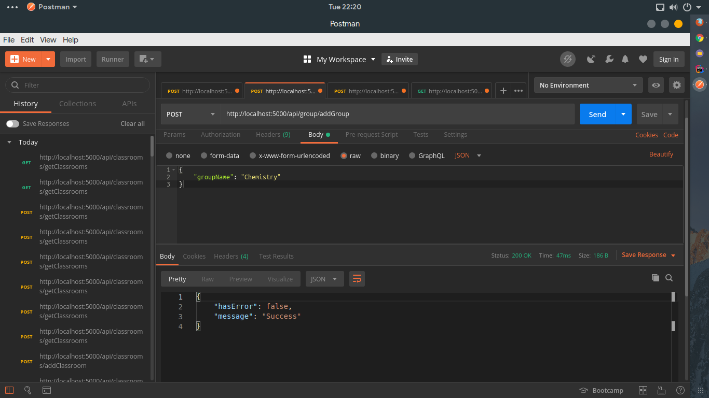
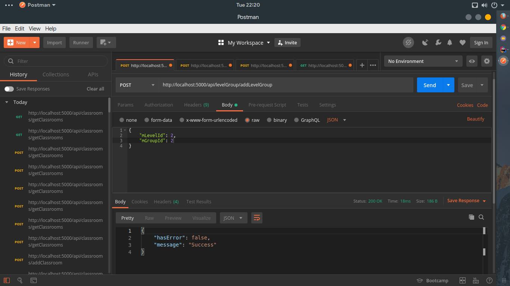
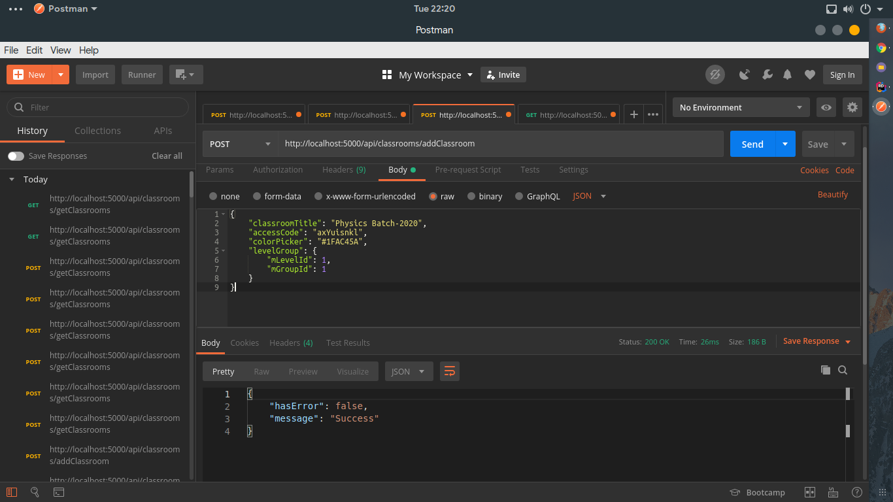
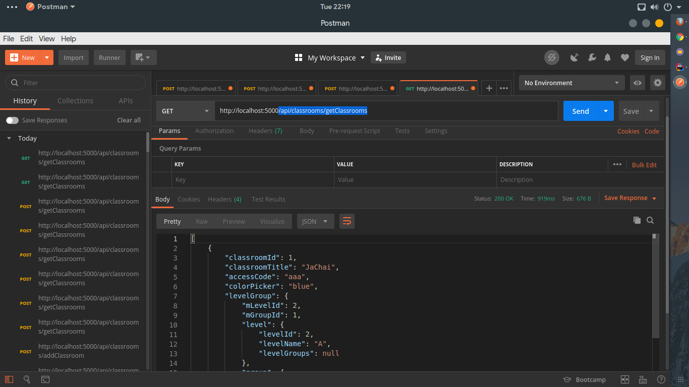

# Mirror API

Fabricated on-test APIs for e-Luminous global edition. The API is hosted in [Heroku](https://www.heroku.com/). You can watch API [Live here](https://github.com/e-Luminous/mirror-api.git)

This sub project is created only to call API for front-end development and Mobile development. For front-end development we'll use [React](https://reactjs.org) and for Mobile development we'll use [Flutter](https://flutter.dev/).

## How API hit the server

### Add Level

There are two types of levels `A Level` and `O level` for Institutions. Admin will check the Levels when creating curriculmn

```
URL: /api/level/addLevel
Verb: POST
Body: {
       	"levelName": "A"
      }
```

### Add Group

Initially we'll work on only Physics and Chemistry group. It can only be accessed from Admin.

```
URL: /api/group/addGroup
Verb: POST
Body: {
       	"groupName": "Chemistry"
      }
```

<p align="center">
     
</p>
<p align="center">
<em> AddGroup response in Postman </em>
</p>

### Add Level Group

Level and Group table has many to many relation between them. So to do **POST** and **GET** request Admin need to hit this third table.

```
URL: /api/levelGroup/addLevelGroup
Verb: POST
Body: {
       	"mLevelId": 1,
      	"mGroupId": 2
      }
```

<p align="center">
     
</p>
<p align="center">
<em> AddLevelGroup response in Postman </em>
</p>

### Add Classroom

This API will be hit by Teacher when he will create a classroom for the students.

```
URL: /api/classrooms/addClassroom
VERB: POST
Body: {
            "classroomTitle": "Tai Pai",
            "accessCode": "aaa",
            "colorPicker": "blue",
            "levelGroup": {
                "mLevelId": 1,
                "mGroupId": 1
            }
        }
```

<p align="center">
     
</p>
<p align="center">
<em> AddClassroom response in Postman </em>
</p>

### Get Classroom

This API call will get all the classroom of the particular teacher and students.

```
URL: /api/classrooms/getClassrooms
VERB: GET
Body: Not Required

```

<p align="center">
     
</p>
<p align="center">
<em> GetClassroom response in Postman </em>
</p>

### Upgrade Classroom

By calling this API Teacher can update his/her classroom information and save it.

```
URL: /api/classrooms/upgradeClassroom
VERB: POST
Body: {
      	"classroomId": 3,
          "classroomTitle": "Physics Batch-2022",
          "accessCode": "axYuisnkl",
          "colorPicker": "#1FAC45A",
          "levelGroup": {
              "mLevelId": 1,
              "mGroupId": 1
          }
      }
```

<p align="center">
     
</p>
<p align="center">
<em> UpgradeClassroom response in Postman </em>
</p>
